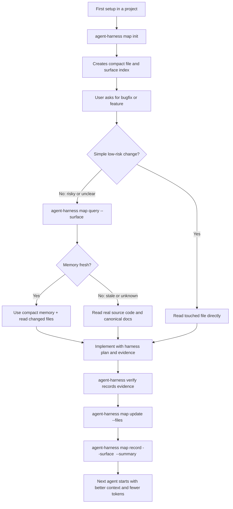

# Agent Execution Harness

[](https://github.com/lordaeternus/agent-execution-harness/actions/workflows/ci.yml)
[](LICENSE)

Agent Execution Harness helps AI coding agents work like disciplined software engineers instead of improvising through your codebase.

AI agents are useful, but they often fail in the same ways:

- they change files before understanding the task
- they skip steps from the plan
- they say tests passed when no test was run
- they invent files, commands, APIs, or validations
- they declare "done" without proof

This project adds a small execution system around the agent.

It does not try to make the model smarter. It makes the agent easier to guide, audit, and stop when the work becomes unsafe.

In plain language: **it is a checklist, memory, and flight recorder for AI-assisted software development.**

It helps an AI agent execute software plans in a more organized way by forcing the agent to:

- follow a plan task by task
- declare which files it expects to touch
- run explicit checks
- record evidence
- verify claims before saying "done"
- stop instead of guessing when work becomes unsafe

## Why Use This?

Use this repo when you want an AI coding agent to:

- create a clear plan before risky work
- execute that plan step by step
- keep a record of what happened
- run checks and attach evidence
- remember useful codebase context for future tasks
- avoid rereading the whole project every time
- avoid claiming success without proof

The harness is especially useful for:

- bug fixes
- refactors
- multi-step features
- AI-assisted code review
- teams experimenting with autonomous coding agents
- projects where "trust me, it works" is not good enough

## What You Get

After installation, your project gets:

- `AGENTS.md` rules that tell the AI agent how to behave
- `agent-harness.config.json` for local policy and artifact settings
- plan validation
- execution artifacts
- evidence-backed final reports
- codebase memory commands
- safety checks for risky commands
- compact output modes to reduce token usage

The intended day-to-day experience is simple:

```txt
You: Find this bug.
Agent: Investigates and proposes a plan.
You: Execute the plan using the harness.
Agent: Executes step by step, records evidence, and reports the artifact.
You: Show me proof.
Agent: Shows run_id, artifact, checks, evidence, claims, and rollback.
```

If the agent cannot show evidence, the work is not complete.

## Table Of Contents

- [Why Use This?](#why-use-this)
- [What You Get](#what-you-get)
- [Quick Start](#quick-start)
- [Codebase Memory Diagram](#codebase-memory-diagram)
- [What Problem Does This Solve?](#what-problem-does-this-solve)
- [For Non-Technical Users](#for-non-technical-users)
- [Installation Options](#installation-options)
- [Common Confusions](#common-confusions)
- [Troubleshooting](#troubleshooting)
- [Why Not Just Prompts?](#why-not-just-prompts)
- [Core Concepts For Developers](#core-concepts-for-developers)
- [CLI Reference](#cli-reference)
- [Configuration](#configuration)
- [Safety Model](#safety-model)
- [Local Development](#local-development)

## Useful Links

- [Quickstart](docs/quickstart.md)
- [Demo workflow](docs/demo.md)
- [Release notes](docs/release-notes/v0.4.0.md)
- [Security policy](SECURITY.md)
- [Contributing guide](CONTRIBUTING.md)
- [npm package](https://www.npmjs.com/package/agent-execution-harness)

## Quick Start

Use this if you want to try the harness in an existing project.

AI agents should read [`docs/agent-runtime.md`](docs/agent-runtime.md) for the short runtime protocol. This README is for humans.

Open a terminal inside your target project:

```bash
cd C:\Projetos\my-app
```

Preview the installation:

```bash
npx agent-execution-harness@latest init --adapter generic --cwd .
```

If the preview looks correct, apply it:

```bash
npx agent-execution-harness@latest init --adapter generic --cwd . --apply
```

If your project already has an `AGENTS.md`, the installer does not overwrite it by default. To add the harness rules to the existing file, use:

```bash
npx agent-execution-harness@latest init --adapter generic --cwd . --apply --agents-mode append
```

Check the installation:

```bash
npx agent-execution-harness@latest doctor --cwd .
```

Expected result:

```txt
status: success
```

After that, talk to your AI coding agent normally:

```txt
Find this bug.
Create a plan.
Execute the approved plan using the harness.
Show me the evidence.
```

The agent should use the harness underneath.

You do not need to memorize the commands below. They show what the agent should run behind the scenes.

Token-light flow for agents:

```bash
agent-harness session start --plan plan.json --run-id fix-id --summary "ctx"
agent-harness next
agent-harness files declare --files src/file.ts
agent-harness task start --task-id task-id --files src/file.ts
agent-harness verify --task-id task-id --type focused_tests --cmd "pnpm test"
agent-harness claim auto
agent-harness finish --summary "Validated."
agent-harness report --run-id fix-id --format compact
```

Codebase memory flow for agents:

```bash
agent-harness map init
agent-harness map query --surface auth
agent-harness map update --files src/auth/session.ts
agent-harness map record --surface auth --files src/auth/session.ts --summary "Auth session owns login state contracts and must be checked before authorization edits."
```

Use this selectively. Simple one-file work does not need a full map. Risky or unclear work should query the affected surface first, then update memory after code changes.

## Codebase Memory Diagram

This feature gives the agent a compact memory of the project without forcing it to reread the whole codebase on every request.

The idea is practical:

- first, build a small map of the project
- then, query only the area related to the task
- after a real change, update the memory
- next time, the agent starts with better context



Step by step:

1. `map init` creates the first compact index of important project files.
2. For simple work, the agent should read the touched file directly and skip extra mapping.
3. For risky or unclear work, the agent runs `map query --surface <surface>` before editing.
4. If memory is `fresh`, it uses the compact summary plus the real files it is changing.
5. If memory is `stale` or `unknown`, it must read the real source code and canonical docs before trusting the cache.
6. After implementation, `verify` records evidence that checks actually ran.
7. `map update --files <files>` refreshes file hashes.
8. `map record` saves only durable facts: contracts, flows, invariants, known traps, and key files.
9. The next agent spends fewer tokens because it can start from compact memory instead of rediscovering the same context.

Truth priority:

```txt
real source code > canonical docs > harness memory > chat history
```

The memory is a cache. It helps the agent move faster, but it never replaces reading the real code when the risk is high.

Good memory entry:

```txt
Auth session owns login state contracts and must be checked before authorization edits.
```

Bad memory entry:

```txt
Code updated.
```

The harness rejects vague memory because vague memory makes future agents worse.

### Copy-Paste Prompt For Your Agent

After installing the harness, give your AI coding agent this instruction:

```txt
Use the agent harness for approved plans, multi-step work, risky changes, and any task where you need to prove completion.
Read docs/agent-runtime.md first; do not load the full README for routine execution.
Before editing, validate the plan.
During execution, keep the harness artifact updated.
Prefer token-light commands: session start, next, verify, claim auto, finish.
For risky or unclear work, query codebase memory before editing and update it after changing durable structure.
Do not claim success unless the artifact is completed and includes evidence plus verified claims.
In the final answer, include run_id, artifact path, status, gates, evidence, verified claims, and rollback notes.
```

## What Problem Does This Solve?

AI coding agents can write code quickly, but speed is not the same as reliable delivery.

Without a harness, an agent can:

- edit before understanding the task
- skip plan steps
- say tests passed without running tests
- invent files, commands, APIs, or validations
- expand scope without noticing
- keep going after dangerous ambiguity
- declare success without proof

This harness reduces those failures by creating an execution contract.

The agent can still reason and write code, but the harness requires a structured artifact that records what actually happened.

That artifact becomes the difference between:

```txt
"I think it is fixed."
```

and:

```txt
"This run completed. Here is the plan, the changed files, the checks, the evidence, the verified claims, and the rollback path."
```

## Explain It Like I Am New To This

Think of the harness as three things:

- a checklist: what the agent must do
- a flight recorder: what the agent actually did
- a memory notebook: what the agent should remember next time

The flight recorder saves proof:

- what task was executed
- what files were involved
- what command was run
- whether the command passed or failed
- what evidence supports the final answer

So when the agent says "done", you can ask:

```txt
Where is the artifact?
What evidence proves it?
Which claims were verified?
```

If the agent cannot answer, the work is not truly complete.

## For Non-Technical Users

### Do I Need To Understand The Commands?

Usually, no.

The intended experience is conversational:

```txt
User: Create a plan.
Agent: Here is the plan.
User: Execute the plan using the harness.
Agent: Runs the harness, edits code, records evidence, and reports the artifact.
```

You only need to know the high-level rule:

> Do not trust "done" unless the agent gives evidence from the harness artifact.

### What Should I Ask The Agent?

Use prompts like these:

```txt
Investigate this bug. Do not edit files yet.
```

```txt
Create a plan with files, risks, tests, and rollback.
```

```txt
Execute this approved plan using the harness.
```

```txt
Do not say it is done unless the harness artifact is completed.
```

```txt
Show me the run_id, artifact path, final status, evidence, tests, and verified claims.
```

### How Do I Know It Worked?

A strong final answer should include:

- `run_id`
- artifact path
- final status
- evidence
- tests or gates executed
- verified claims
- rollback notes when relevant

The safest completion signal is:

```txt
status: completed
phase: completed
verified claims: present
evidence: present
```

If those fields are missing, treat the work as partial.

### Good Final Answer Example

```txt
run_id: fix-login-20260428
artifact: .agent-harness/runs/fix-login-20260428.json
status: completed
gates: pnpm test:run tests/login.test.ts
evidence: exit_code 0, affected login tests passed
verified claims: bug_reproduced_before_fix, bug_fixed_after_fix, acceptance_criteria_met
rollback: revert commit abc123 or restore files listed in the artifact
```

### Weak Final Answer Example

```txt
Done. It should work now.
```

Do not trust this. It has no artifact, no evidence, and no verified claims.

## Installation Options

You can use the harness without becoming an npm expert.

If you are new, use `npx`. It downloads and runs the latest package for you.

### Option 1: Use With npx

This is the easiest path.

Preview:

```bash
npx agent-execution-harness@latest init --adapter generic --cwd .
```

Apply:

```bash
npx agent-execution-harness@latest init --adapter generic --cwd . --apply
```

If `AGENTS.md` already exists, choose how to handle it:

```bash
# safest default: keep the current AGENTS.md unchanged
npx agent-execution-harness@latest init --adapter generic --cwd . --apply --agents-mode skip

# recommended for most existing projects: append harness rules to the current AGENTS.md
npx agent-execution-harness@latest init --adapter generic --cwd . --apply --agents-mode append

# strongest but risky: replace AGENTS.md after backup
npx agent-execution-harness@latest init --adapter generic --cwd . --apply --agents-mode overwrite
```

Check:

```bash
npx agent-execution-harness@latest doctor --cwd .
```

### Option 2: Install In The Project

Use this when you want the harness pinned as a project dependency.

```bash
npm install --save-dev agent-execution-harness
```

Then commands are available as:

```bash
agent-harness doctor --cwd .
agent-harness run
agent-harness report
```

### Stetix-Style Project

For projects that want the Stetix adapter:

```bash
npx agent-execution-harness@latest init --adapter stetix --cwd .
```

Apply:

```bash
npx agent-execution-harness@latest init --adapter stetix --cwd . --apply
```

## Common Confusions

This section explains the common terms without assuming you are a developer.

### What Is npm?

npm is the package registry where this tool is published.

GitHub stores the source code. npm distributes the installable package.

### What Is npx?

`npx` runs a package from npm without requiring you to install it manually first.

This command:

```bash
npx agent-execution-harness@latest doctor --cwd .
```

means:

```txt
Download the latest harness package, run its doctor command, and check this project.
```

### Is The Harness Automatic?

Only when the project and agent are configured to use it.

The harness is not hidden magic inside every AI tool. It works when:

1. the project has harness files installed
2. the project has clear `AGENTS.md` rules
3. the agent reads and follows those rules
4. the agent can run local commands
5. the task matches a rule requiring the harness

For example:

```txt
For approved multi-step plans, use the agent harness.
Do not declare success without a completed artifact, evidence, and verified claims.
```

### Can A Bad Agent Ignore It?

Yes, if the surrounding tool lets it ignore project instructions.

The harness makes correct behavior easier to enforce and audit, but it cannot physically control every possible model or coding tool unless that tool invokes it.

That is why the final answer must include artifact evidence.

Practical rule:

```txt
No artifact, no evidence, no trust.
```

## Troubleshooting

### `npx` asks whether to install the package

That is normal. Accept it.

### `doctor` does not return `status: success`

Read the findings. Usually this means one of these is missing:

- `AGENTS.md`
- `agent-harness.config.json`
- package scripts
- ignored artifact folder

Fix the reported item and run doctor again.

### The agent says it used the harness but gives no artifact

Treat the work as incomplete. Ask:

```txt
Show the run_id, artifact path, final status, evidence, and verified claims.
```

### The agent refuses or forgets to use the harness

Add a stronger project instruction in `AGENTS.md`:

```txt
For approved plans, multi-step work, risky changes, and delegated execution, use agent-harness.
Do not declare success without a completed artifact, evidence, and verified claims.
```

### I only want to try it without changing my project

Run the init command without `--apply`:

```bash
npx agent-execution-harness@latest init --adapter generic --cwd .
```

This is a preview. It should not apply the installation.

## Why Not Just Prompts?

Prompts are useful, but prompts are memory and intention. They can be ignored, forgotten, or interpreted differently by different models.

Agent Execution Harness turns the most important parts of the workflow into explicit runtime artifacts:

- the plan is structured
- the current phase is recorded
- allowed actions are constrained
- evidence must match a gate
- claims must be verified
- final reports are derived from artifacts

The harness does not replace prompts. It gives prompts something harder to drift away from.

Practical difference:

```txt
Prompt only:
"Please be careful and run tests."

Harness-backed:
"Record the gate, record exit_code, attach output excerpt, verify the claim, and only then report completion."
```

That is why this project focuses on execution evidence, not just better wording.

## What Installation Adds To A Project

The installer is designed to configure harness-related files such as:

- `AGENTS.md`
- `agent-harness.config.json`
- package scripts
- ignored artifact folders
- plan/checklist templates
- adapter-specific rules

If the project already has `AGENTS.md`, the installer is conservative:

- default behavior: keep the existing file unchanged
- `--agents-mode append`: add a marked harness block once
- `--agents-mode overwrite`: replace the file, with backup created first

The harness artifact folder is usually:

```txt
.agent-harness/runs/
```

Those artifacts prove what the agent actually did.

## Core Concepts For Developers

### Plan

A plan is a JSON document with:

- `schema_version`
- `plan_id`
- `risk_level`
- `rollback_expectation`
- `gates`
- `tasks`

Each task must include:

- `task_id`
- `acceptance_criteria`

Example:

```json
{
  "schema_version": "agent_harness_plan_v1",
  "plan_id": "basic-plan",
  "risk_level": "L2",
  "rollback_expectation": "Delete generated test files.",
  "gates": ["node --version"],
  "tasks": [
    {
      "task_id": "basic-task",
      "acceptance_criteria": "node --version evidence passes."
    }
  ]
}
```

### Action

An action is one state transition requested by the agent.

Supported actions:

- `read_context`
- `declare_files`
- `edit_file_ready`
- `run_gate`
- `record_evidence`
- `verify_claims`
- `final_report`
- `halt_for_risk`

### Artifact

The artifact is the source of truth for execution.

Default path:

```txt
.agent-harness/runs/<run_id>.json
```

If the artifact is not completed, the work is not complete.

### Evidence

Evidence records proof that a gate or check happened.

Each evidence item records:

- `evidence_id`
- optional `evidence_type`
- optional `evidence_types`
- `check`
- `result`
- `exit_code`
- `output_excerpt`
- `scope_covered`
- optional `residual_gap`
- optional `output_ref` and `sha256` for long logs stored outside chat

Evidence types let the harness compare proof against the plan:

```json
{
  "evidence_id": "ui-verification",
  "evidence_types": ["focused_tests", "scoped_lint", "scoped_typecheck", "visual_assertion"],
  "check": "pnpm agent:verify:ui",
  "result": "pass",
  "exit_code": 0,
  "output_excerpt": "Focused tests, lint, typecheck and visual assertion passed.",
  "scope_covered": "sidebar UI verification"
}
```

### Evidence Policy

Plans may declare required evidence per task:

```json
{
  "task_id": "verify-sidebar-layout",
  "surface": "ui_layout",
  "files": ["src/components/AppLayout.tsx"],
  "required_evidence": [
    "focused_tests",
    "scoped_lint",
    "scoped_typecheck",
    "browser_smoke|visual_assertion"
  ],
  "acceptance_criteria": "Sidebar layout has no overlap."
}
```

If `required_evidence` is not provided, the harness infers requirements from the task `surface` and files. UI/layout work requires focused tests, scoped lint, scoped typecheck and browser smoke or visual assertion before a run can be `completed`.

If required proof is missing, the run becomes `partial_validated` instead of `completed`, and the report shows the evidence score plus missing requirements.

### Claims

A claim is something the agent wants to assert as true.

Supported claim kinds include:

- `file_exists`
- `command_ran`
- `gate_passed`
- `gate_failed`
- `dangerous_command_blocked`
- `task_reconciled`
- `bug_reproduced_before_fix`
- `bug_fixed_after_fix`
- `acceptance_criteria_met`
- `contract_preserved`
- `rollback_defined`
- `no_product_code_changed`

Final reports should be derived from verified claims, not from agent confidence.

## State Machine

The run follows this lifecycle:

```txt
init -> preflight -> task_start -> gate -> evidence -> report -> completed
```

A run may also enter:

```txt
halt
```

Meaning:

- `init`: run created
- `preflight`: context read, files must be declared
- `task_start`: task execution can begin
- `gate`: validation command must be declared
- `evidence`: validation result must be recorded
- `report`: claims must be verified and final report produced
- `completed`: run is complete
- `halt`: execution stopped for safety or invalid state

## CLI Reference

When installed from npm, use:

```bash
agent-harness <command>
```

When developing from this repository, use:

```bash
node bin/agent-harness.mjs <command>
```

### `init`

Prepares a target project using templates.

```bash
agent-harness init --adapter generic --cwd .
```

By default, `init` is a dry run. Applying changes must be explicit:

```bash
agent-harness init --adapter generic --cwd . --apply
```

Existing `AGENTS.md` handling:

```bash
agent-harness init --adapter generic --cwd . --apply --agents-mode skip
agent-harness init --adapter generic --cwd . --apply --agents-mode append
agent-harness init --adapter generic --cwd . --apply --agents-mode overwrite
```

Without `--agents-mode`, interactive terminals ask what to do. Non-interactive runs use `skip` to avoid overwriting user instructions.

### `doctor`

Checks whether a project is configured correctly.

```bash
agent-harness doctor --cwd .
```

### `plan-lint`

Validates a plan before execution.

```bash
agent-harness plan-lint --plan plan.json
```

### `execute`

Initializes or resumes a run.

```bash
agent-harness execute --plan plan.json --run-id fix-login
```

### `session start`

Starts an active low-token session so later commands do not need to repeat `--plan`, `--run-id` and `--mode`.

```bash
agent-harness session start --plan plan.json --run-id fix-login
```

### `next`

Returns only the next actionable step from the current artifact.

```bash
agent-harness next
```

### `verify`

Runs a policy-checked command, stores long output as a referenced log, records `sha256`, and creates evidence automatically.

```bash
agent-harness verify --task-id fix-login --type focused_tests --cmd "pnpm test"
```

### `map`

Maintains compact codebase memory for selective reuse.

```bash
agent-harness map init
agent-harness map status
agent-harness map query --surface auth
agent-harness map update --files src/auth/session.ts
agent-harness map record --surface auth --files src/auth/session.ts --summary "Auth session owns login state contracts and must be checked before authorization edits."
```

Use `map query` before risky or unclear work. Use `map update` after changed files. Use `map record` only for durable facts: contracts, flows, invariants, known traps, and key files.

### `run`

Applies one low-level action to the run state.

```bash
agent-harness run \
  --plan plan.json \
  --run-id fix-login \
  --action '{"schema_version":"agent_harness_action_v1","type":"read_context","summary":"Read plan and repo context."}'
```

This is the transactional command used by autonomous agents.

### `report`

Generates a final report from a completed artifact.

```bash
agent-harness report --run-id fix-login
```

### `benchmark`

Runs an offline benchmark over captured scenarios.

```bash
agent-harness benchmark --mode smoke
```

The benchmark does not call model APIs.

## Configuration

Projects can define:

```txt
agent-harness.config.json
```

Example:

```json
{
  "schema_version": "agent_harness_config_v1",
  "artifact_dir": ".agent-harness/runs",
  "product_paths": ["src/", "supabase/"],
  "required_scripts": ["agent:harness", "agent:plan:lint"],
  "doctor_profile": "generic",
  "command_policy": {
    "allow": [],
    "deny": ["DROP", "TRUNCATE", "git reset --hard", "push --force"]
  },
  "token_budget": {
    "observation_format": "ultra_compact",
    "summary_max_chars": 240,
    "output_excerpt_max_chars": 600,
    "report_compact_max_chars": 1600
  },
  "codebase_memory": {
    "enabled": true,
    "memory_dir": ".agent-harness/memory",
    "default_strategy": "query",
    "stale_after_days": 14,
    "max_summary_chars": 1200,
    "surface_budgets": {
      "auth": 1800,
      "db": 1800,
      "api": 1400,
      "ai": 1400,
      "ui": 900,
      "ui_layout": 900,
      "docs": 500,
      "generic": 700
    },
    "high_risk_surfaces": ["auth", "db", "api", "ai"]
  }
}
```

Important fields:

- `artifact_dir`: where run artifacts are stored
- `product_paths`: paths treated as product code
- `required_scripts`: scripts expected by doctor
- `doctor_profile`: validation profile for the project
- `command_policy`: allow/deny rules for commands
- `token_budget`: controls compact output and log excerpt limits
- `codebase_memory`: controls selective repository mapping and memory freshness

Deny rules take priority over allow rules.

## Safety Model

The harness blocks or halts when it sees unsafe behavior, including:

- destructive database commands
- destructive Git commands
- force push
- recursive forced deletion
- evidence that does not match the pending gate
- final report before verified claims
- completion before all tasks are reconciled

This does not replace human judgment. It creates mechanical pressure against unsafe automation.

## What This Harness Does Not Promise

This harness does not guarantee that:

- the model will understand the product perfectly
- every bug will be found
- every generated test is meaningful
- every architectural decision is correct
- no human review is needed

It does provide stronger operating discipline:

- work is decomposed into tasks
- state is recorded
- evidence is required
- claims are checked
- dangerous operations are blocked or halted
- final reports are derived from artifacts

## Local Development

Use this section only if you want to edit or contribute to the harness itself.

Install dependencies:

```bash
pnpm install
```

Run typecheck:

```bash
pnpm typecheck
```

Run tests:

```bash
pnpm test
```

Build:

```bash
pnpm build
```

Run integration tests:

```bash
pnpm test:integration
```

Run smoke benchmark:

```bash
pnpm benchmark:smoke
```

Run release readiness audit:

```bash
pnpm audit:release-readiness
```

## Project Status

Current version:

```txt
0.4.0
```

Package:

```txt
agent-execution-harness
```

Treat this as an early public foundation for structured AI-assisted development.

It is useful today if you want agents to work with plans, evidence, safety stops, compact memory, and audit-friendly reports.
